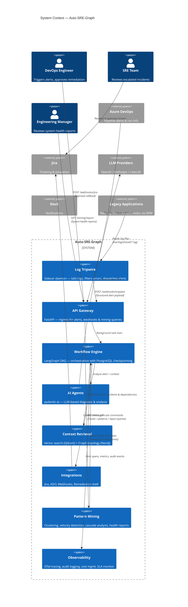
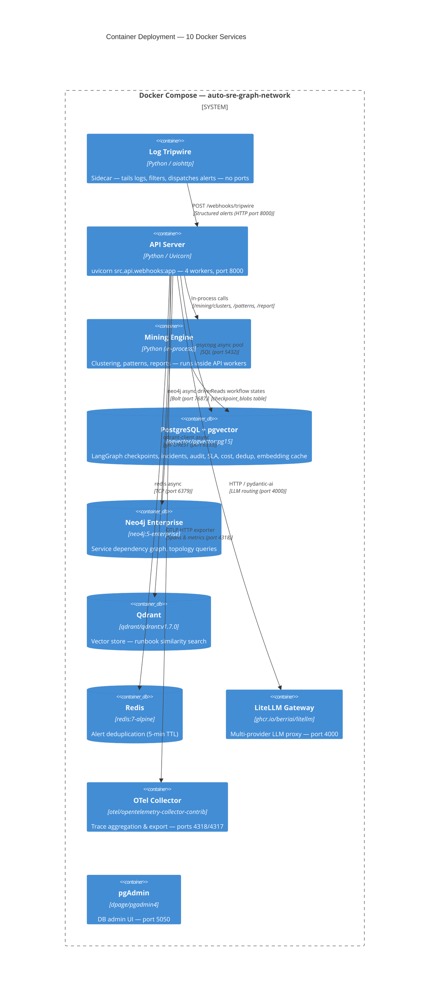
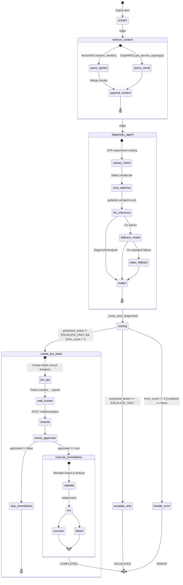
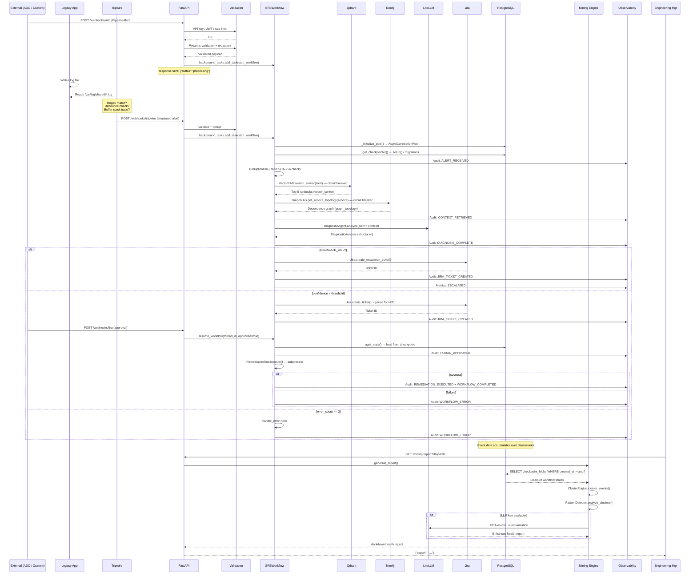
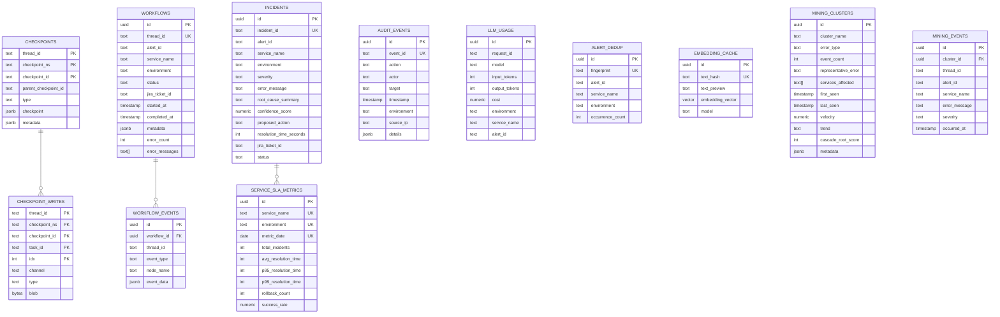
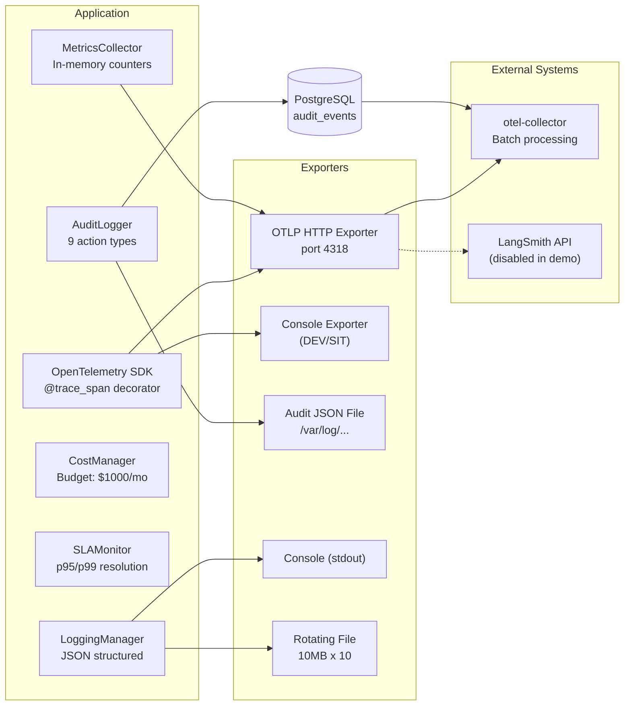
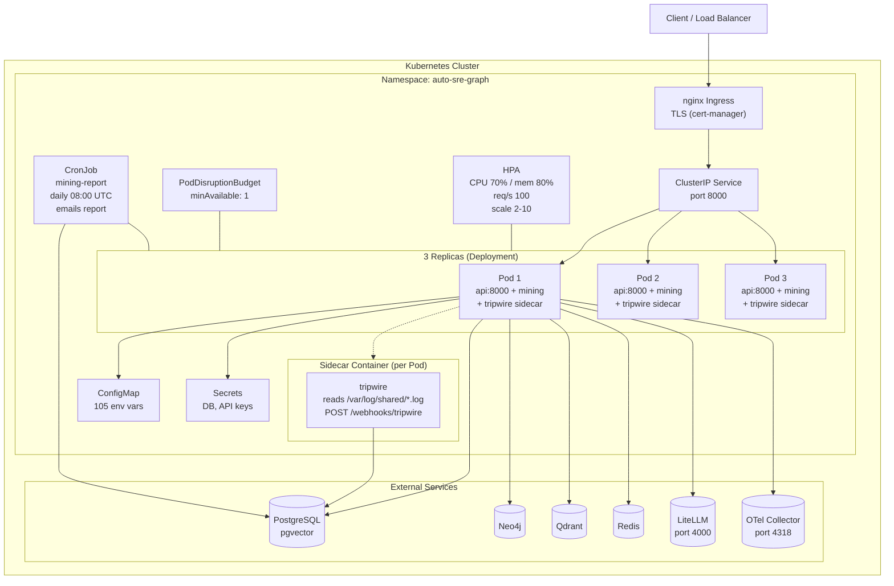
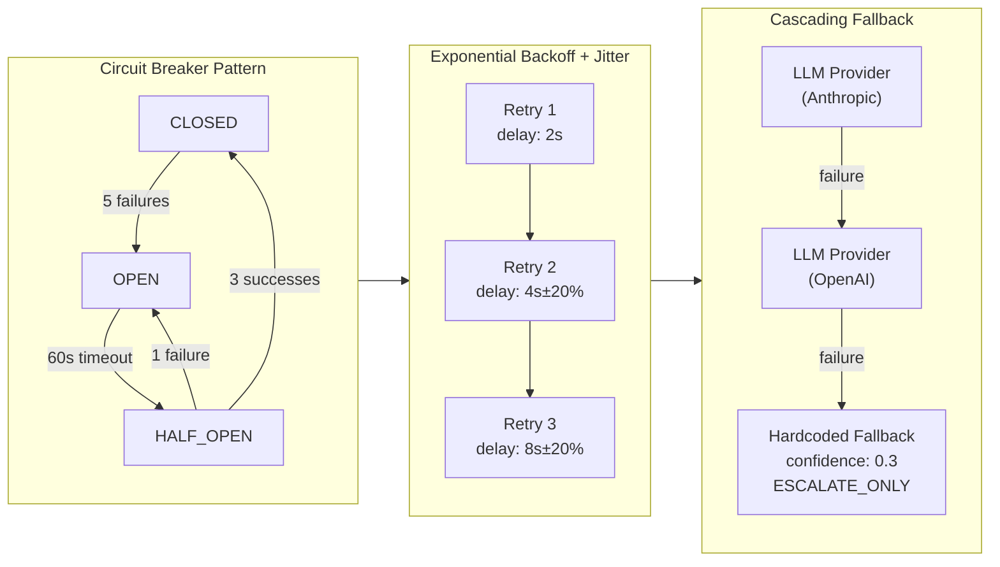

# Auto-SRE-Graph Architecture

## Diagram 1 — System Context (C4 Level 1)

---

## Diagram 2 — Container Deployment (Docker Compose)

---

## Diagram 3 — Workflow State Machine (LangGraph DAG)

---

## Diagram 4 — Data Flow (End-to-End)

---

## Diagram 5 — Component Architecture (Layered)

```mermaid
flowchart TB
  subgraph API_Layer["API Layer (src/api)"]
    Webhooks["webhooks.py<br/>FastAPI app<br/>5 endpoints"]
    Deps["dependencies.py<br/>Security / RateLimit / Validation"]
  end

  subgraph Orchestrator["Orchestration Layer (src/orchestrator)"]
    Graph["graph.py<br/>SREWorkflow<br/>LangGraph DAG"]
    State["state.py<br/>SREWorkflowState TypedDict"]
    Checkpointer["checkpointer.py<br/>AsyncPostgresSaver<br/>Pool Manager"]
    Dedup["deduplication.py<br/>AlertDeduplicator"]
    Recovery["recovery.py<br/>CircuitBreaker / Retry"]
    Canary["canary.py<br/>A-B Experiments"]
  end

  subgraph Agents["Agent Layer (src/agents)"]
    Diagnostician["diagnostician.py<br/>pydantic-ai Agent"]
    Prompts["prompts.py<br/>SRE System Prompt"]
  end

  subgraph Context["Context Layer (src/context)"]
    VectorRAG["vector_rag.py<br/>Qdrant client"]
    GraphRAG["graph_rag.py<br/>Neo4j client"]
    Embeddings["embeddings.py<br/>OpenAI / Cohere / HF"]
  end

  subgraph Integrations["Integration Layer (src/integrations)"]
    Jira["jira.py<br/>Jira REST API"]
    ADO["ado.py<br/>Azure DevOps API"]
    WebhookHandler["webhook_handler.py<br/>Generic processor"]
  end

  subgraph Tripwire["Log Ingestion (src/tools)"]
    TripwireDaemon["tripwire.py<br/>TripwireDaemon<br/>DebounceCapacitor"]
  end

  subgraph Mining["Mining Layer (src/mining)"]
    ClusterEngine["cluster_engine.py<br/>Token/Embedding clustering"]
    PatternDet["pattern_detector.py<br/>Velocity + cascade analysis"]
    ReportGen["report_generator.py<br/>LLM + rule-based reports"]
    EventStore["event_store.py<br/>PostgreSQL queries"]
  end

  subgraph Tools["Tools Layer (src/tools)"]
    Remediation["remediation.py<br/>Allowlisted subprocess"]
  end

  subgraph Observability["Observability (src/observability)"]
    Tracing["tracing.py<br/>OTel + MetricsCollector"]
    Audit["audit.py<br/>9 action types"]
    Cost["cost_manager.py<br/>LLM cost tracking"]
    SLA["sla_monitor.py<br/>Service levels"]
    Logging["logging.py<br/>Structured JSON"]
  end

  subgraph Models["Model Layer (src/models)"]
    Schemas["schemas.py<br/>PipelineAlert,<br/>DiagnosticAnalysis,<br/>JiraTicketDraft"]
    Validators["validators.py<br/>WebhookValidation,<br/>AlertFilter"]
  end

  subgraph Config["Configuration (src/config)"]
    Settings["settings.py<br/>70+ env vars"]
    Constants["constants.py<br/>Enums & defaults"]
  end

  Webhooks --> Deps
  Webhooks --> Graph
  Graph --> State
  Graph --> Checkpointer
  Graph --> Dedup
  Graph --> Recovery
  Graph --> Canary
  Graph --> Diagnostician
  Graph --> VectorRAG
  Graph --> GraphRAG
  Graph --> Jira
  Graph --> Remediation
  Graph --> Tracing
  Graph --> Audit
  Graph --> Cost
  Graph --> SLA
  Diagnostician --> Prompts
  Diagnostician --> Embeddings
  Jira --> WebhookHandler
  VectorRAG --> Embeddings
  Graph --> Settings
  Graph --> Schemas
  Graph --> Validators
  Webhooks --> TripwireDaemon
  ApiMining["/mining routes"] --> ClusterEngine
  ApiMining --> PatternDet
  ApiMining --> ReportGen
  ApiMining --> EventStore
  EventStore --> Graph
  ClusterEngine --> Embeddings
```

---

## Diagram 6 — Database Schema (Entity-Relationship)

---

## Diagram 7 — Observability Stack

---

## Diagram 8 — Kubernetes Deployment

---

## Diagram 9 — Error & Resilience Patterns

