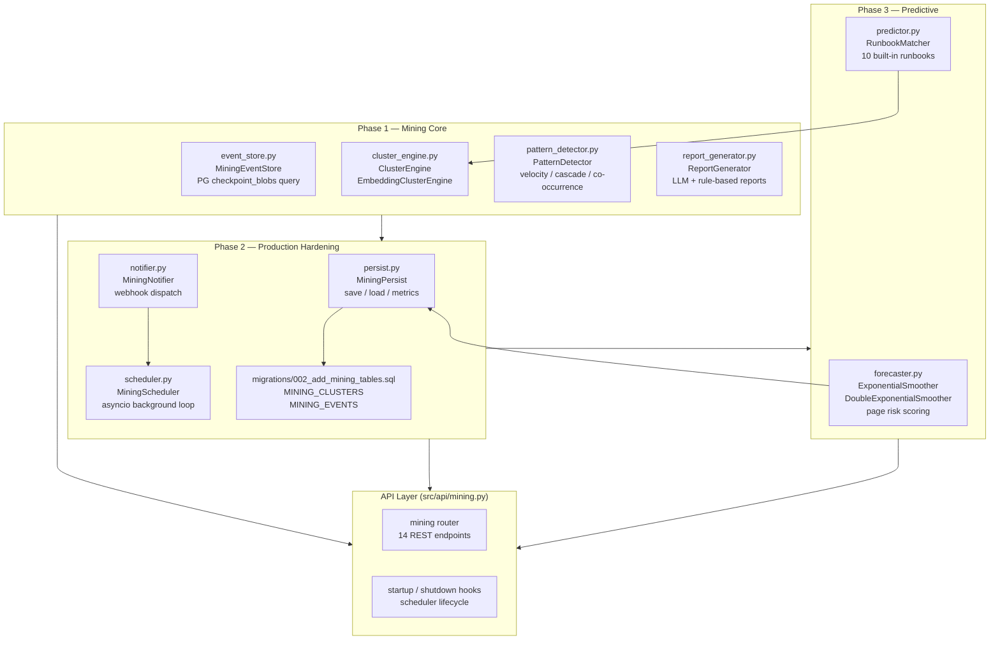
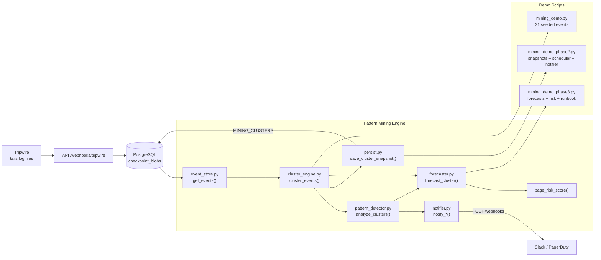
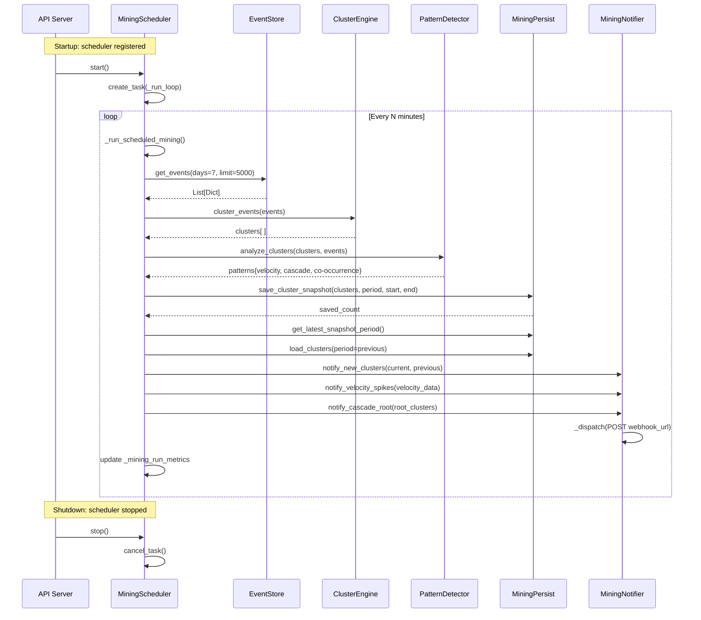
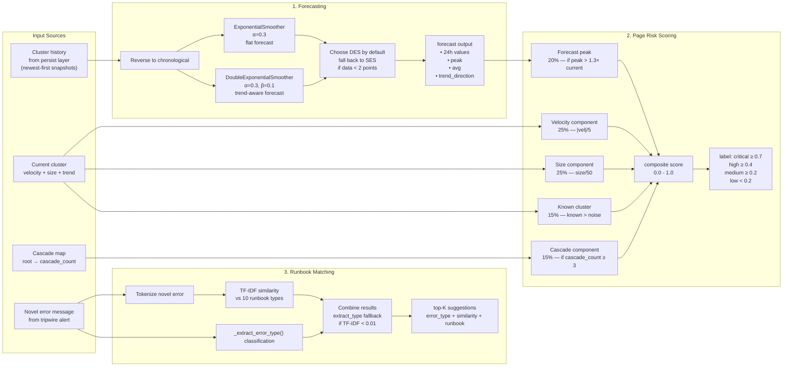
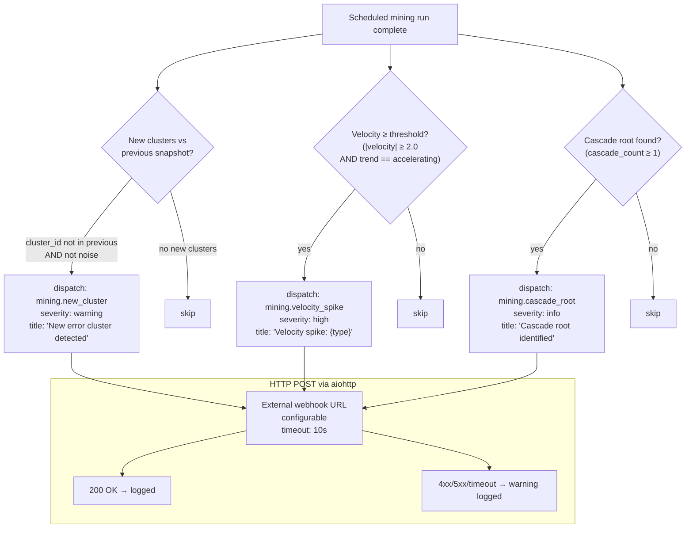
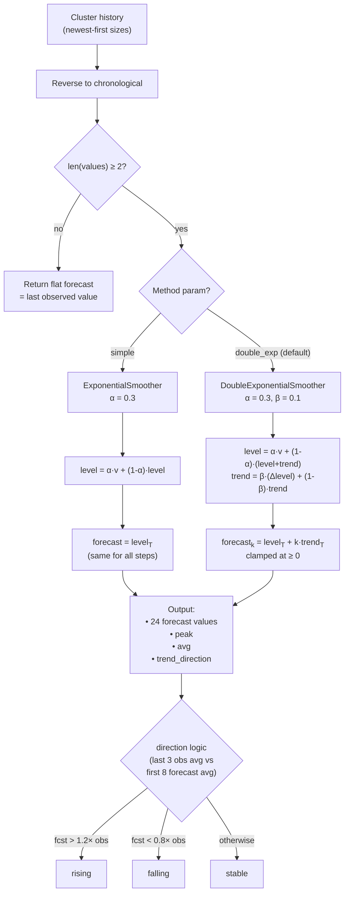
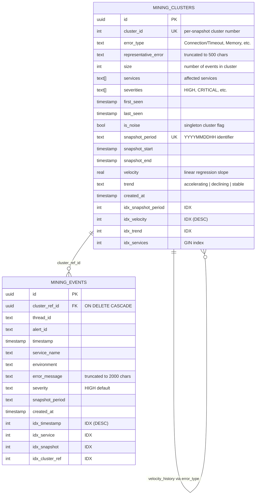

# Pattern Mining Engine — Architecture (All Phases)

Covers the mining subsystem across all three implementation phases.
See `ARCHITECTURE.md` for the broader Auto-SRE-Graph system.

---

## Diagram 1 — Mining Engine Component Architecture

---

## Diagram 2 — End-to-End Mining Data Pipeline

---

## Diagram 3 — Phase 2: Production Hardening Flow

---

## Diagram 4 — Phase 3: Prediction Pipeline

---

## Diagram 5 — Mining API Surface (All Phases)

```mermaid
flowchart LR
  subgraph Phase1API["Phase 1 — Core"]
    C1["GET /mining/clusters<br/>Query: days, min_size, service, use_embeddings<br/>→ clusters[ ]"]
    C2["GET /mining/clusters/{id}/events<br/>Query: limit<br/>→ events[ ]"]
    P1["GET /mining/patterns<br/>→ cascade_roots, co-occurrence, velocity"]
    R1["GET /mining/report<br/>Query: format=markdown<br/>→ LLM/rule-based report"]
    T1["GET /mining/timeline<br/>Query: granularity=hour|day<br/>→ event count time-series"]
    S1["GET /mining/services<br/>→ service × cluster impact matrix"]
  end

  subgraph Phase2API["Phase 2 — Hardening"]
    M1["GET /mining/metrics<br/>→ total_snapshots, clusters, velocity, scheduler status"]
    SN1["GET /mining/snapshots<br/>→ latest persisted clusters"]
    RU1["POST /mining/run<br/>→ trigger immediate mining cycle"]
  end

  subgraph Phase3API["Phase 3 — Predictive"]
    PR1["GET /mining/predictions<br/>Query: hours, min_risk, top_n<br/>→ ranked page-risk scores"]
    PR2["GET /mining/predictions/{id}<br/>→ 24h forecast + daily history"]
    RB1["POST /mining/runbook-suggestion<br/>Body: {error_message}<br/>→ top-K runbook matches"]
    RB2["GET /mining/runbooks<br/>Query: error_type<br/>→ list or lookup runbooks"]
  end

  Phase1API --> Phase2API
  Phase2API --> Phase3API
```

---

## Diagram 6 — Notification Decision Tree

---

## Diagram 7 — Forecasting Model Selection

---

## Diagram 8 — Database Schema (Mining Tables)

---

## File Inventory by Phase

| Phase | File | Purpose |
|-------|------|---------|
| 1 | `src/mining/event_store.py` | Query PostgreSQL `checkpoint_blobs` for workflow states |
| 1 | `src/mining/cluster_engine.py` | TF-IDF token clustering + embedding clustering (fallback) |
| 1 | `src/mining/pattern_detector.py` | Velocity regression, cascade roots, co-occurrence, heatmap |
| 1 | `src/mining/report_generator.py` | LLM-enhanced reports (GPT-4o-mini) + rule-based fallback |
| 1 | `src/api/mining.py` | 6 core REST endpoints + `/metrics`, `/snapshots`, `/run` |
| 1 | `mining_demo.py` | 31 seeded events across 5 real-world clusters |
| 2 | `src/mining/persist.py` | PostgreSQL CRUD for `MINING_CLUSTERS` + `MINING_EVENTS` |
| 2 | `src/mining/scheduler.py` | `asyncio` background mining loop with configurable interval |
| 2 | `src/mining/notifier.py` | `aiohttp` webhook dispatch for new clusters, spikes, roots |
| 2 | `migrations/002_add_mining_tables.sql` | DDL for mining tables with GIN indexes |
| 2 | `mining_demo_phase2.py` | Cross-snapshot diff, scheduler lifecycle, notification log |
| 3 | `src/mining/forecaster.py` | SES + DoubleES forecasting, page risk scoring, cluster ranking |
| 3 | `src/mining/predictor.py` | TF-IDF runbook matcher with 10 built-in runbooks |
| 3 | `mining_demo_phase3.py` | Forecast table, risk ranking, runbook suggestions |
